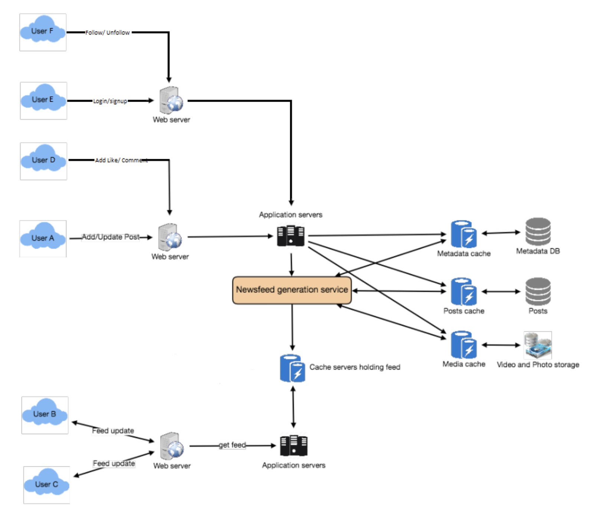
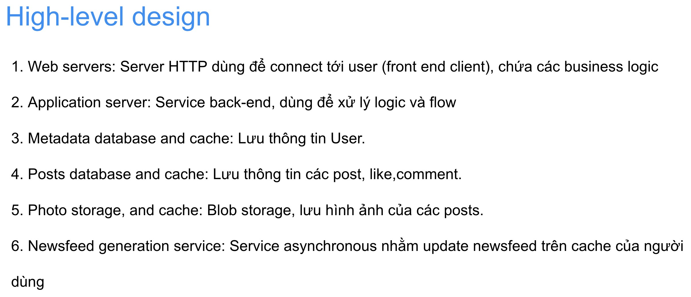

# High level design

High level design chỉ có sau khi design API

- vì phải có requirement cụ thể đàng hoàng rồi các đầu api thì mới tính đc high level design
- nếu ngược lại có high level design trước thì chốc nữa sẽ kh match với các use case và api
- ở bước này chỉ nên design những gì đã có từ các bước trước.
- design đơn giản mà đủ chưa cần optimize vì optimize ở bước 7 sẽ làm sau.

> High level design để cho chúng ta thấy ta có những component nào và các component giao tiếp với nhau ra sao

